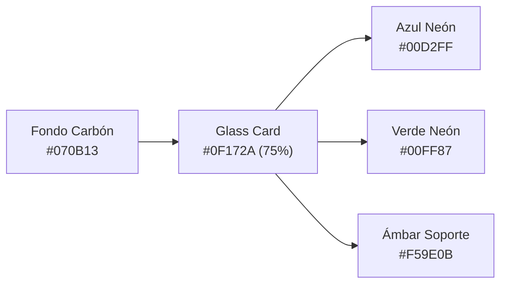

# Guía de Estilo e Identidad Visual — LDDIGITALCO

> **Versión 1.0** • Manual de Marca, Diseño UI/UX y Sistema de Diseño para la plataforma web y ecosistema de servicios de **LDDIGITALCO**.

---

## 1. Fundamentos de Marca y Propuesta de Valor

* **Nombre Oficial:** **LDDIGITALCO**
* **Nombres Secundarios / Divisiones:**
  * `LD Digital Co` (División Corporativa, Emprendedores y Marca Personal)
  * `Programa +50` (División de Inclusión Digital y Ciberseguridad para la Tercera Edad)
* **Tagline Principal:** *"Impulsamos su Negocio y Acercamos la Tecnología a Cada Etapa"*
* **Esencia de Marca:** Fusión equilibrada entre **vanguardia tecnológica** (automatización con IA, aceleración de negocios y autoridad de marca) y **calidez humana / paciencia** (acompañamiento para personas mayores de 50 años).

---

## 2. Tono de Comunicación y Voz por Audiencia

LDDIGITALCO se comunica en dos registros claramente definidos según el segmento:

| Dimensión | B2B & Marcas Personales (Emprendedores, Directivos) | Programa +50 (Adultos Mayores y Familiares) |
| :--- | :--- | :--- |
| **Personalidad** | Visionaria, ágil, analítica, orientada al retorno de inversión (*ROI*). | Empática, paciente, cercana, protectora y estimulante. |
| **Vocabulario** | Términos de negocio: *IA generativa, agentes, optimización, embudos, autoridad*. | Lenguaje cotidiano: *sin miedo, paso a paso, comunicación con la familia, claves seguras*. |
| **Enfoque de Valor** | Ahorro de tiempo, escalabilidad, diferenciación en el mercado. | Autonomía personal, tranquilidad, prevención de estafas, disfrute de la tecnología. |
| **Llamado a la Acción** | *«Agendar Diagnóstico Estratégico»*, *«Solicitar Propuesta B2B»*, *«Construir mi Marca»*. | *«Inscribirme al Programa»*, *«Aprender a mi Ritmo»*, *«Hablar por WhatsApp»*. |

---

## 3. Paleta Cromática y Tokens de Color

La identidad se basa en un **Modo Oscuro Carbón** sofisticado con dos acentos de **Neón de Alto Impacto**:



### Tabla de Códigos de Color

| Rol / Uso | Nombre | Código Hex | Variable CSS | Significado y Aplicación |
| :--- | :--- | :--- | :--- | :--- |
| **Fondo Principal** | Deep Carbon | `#070B13` | `--bg-dark` | Base oscura de toda la web; reduce fatiga visual y realza los neones. |
| **Superficie de Tarjetas** | Glass Slate | `#0F172A` | `--bg-card` | Fondo translúcido con desenfoque (*backdrop blur 16px*) y opacidad al 75%. |
| **Acento B2B / IA** | Neon Cyan | `#00D2FF` | `--neon-blue` | Inteligencia artificial, tecnología corporativa, badges de B2B e hipervínculos. |
| **Acento Éxito / Senior** | Neon Emerald | `#00FF87` | `--neon-green` | Programa +50, botones de conversión principal (*CTAs*), estados activos y seguridad. |
| **Puente Híbrido** | Cyan Teal | `#2DD4BF` | `--neon-teal` | Gradientes de transición entre B2B y Senior; etiquetas del Modelo Híbrido. |
| **Alerta / Dudas** | Amber Glow | `#F59E0B` | `--amber-alert` | Botón *«Tengo una Duda»* y asistencia al estudiante en el LMS. |
| **Bordes Estructurales** | Dark Slate | `#1E293B` | `--border-dark` | Líneas divisorias sutiles para delimitar tarjetas y cabeceras sin ruido visual. |
| **Texto Principal** | Pure Ice | `#FFFFFF` / `#E2E8F0` | `--text-main` | Titulares y textos principales de máximo contraste (mínimo 14:1 en fondo oscuro). |
| **Texto Secundario** | Muted Slate | `#94A3B8` | `--text-muted` | Párrafos descriptivos, metadatos y duraciones de cápsulas de video. |

---

## 4. Tipografía y Jerarquía Visual

El sistema tipográfico utiliza dos familias complementarias alojadas en Google Fonts:

### 1. `Space Grotesk` (Titulares, Números y Badges Tecnológicos)
* **Propósito:** Transmite precisión, modernidad geométrica y carácter digital.
* **Pesos utilizados:** `700 (Bold)`, `800 (Extra Bold)`.
* **Clase CSS:** `.font-tech`

### 2. `Plus Jakarta Sans` (Texto de Párrafo, Menús, Botones y Formularios)
* **Propósito:** Tipografía *humanista*, con gran legibilidad en pantallas de cualquier tamaño y altura de 'x' equilibrada.
* **Pesos utilizados:** `400 (Regular)`, `500 (Medium)`, `600 (Semi Bold)`, `700 (Bold)`.

### Escala Tipográfica Recomendada

| Elemento | Tamaño Desktop | Tamaño Mobile | Peso | Familia | Interlineado |
| :--- | :--- | :--- | :--- | :--- | :--- |
| **Hero H1** | `64px - 72px` | `36px - 40px` | `800` | Space Grotesk | `1.1` (Apretado) |
| **Secciones H2** | `36px - 44px` | `28px - 32px` | `700` | Space Grotesk | `1.2` |
| **Títulos Tarjetas H3** | `20px - 24px` | `18px - 20px` | `700` | Space Grotesk | `1.3` |
| **Cuerpo General** | `15px - 16px` | `14px - 15px` | `400 / 500` | Plus Jakarta Sans | `1.6` (Espaciado) |
| **Cuerpo Programa +50** | `18px - 20px` | `16px - 18px` | `500` | Plus Jakarta Sans | `1.65` (Grande) |
| **Etiquetas / Badges** | `10px - 12px` | `10px - 11px` | `700` | Space Grotesk | `1.0` (Mayúsculas) |

---

## 5. Efectos de Resplandor Neón y Glassmorphism

Los efectos neón deben aplicarse con sutileza para iluminar sin saturar:

```css
/* Resplandor Azul (B2B e IA) */
.glow-blue {
  box-shadow: 0 0 35px -5px rgba(0, 210, 255, 0.3);
}

.glow-border-blue {
  border-color: rgba(0, 210, 255, 0.5);
  box-shadow: inset 0 0 15px rgba(0, 210, 255, 0.1), 0 0 20px rgba(0, 210, 255, 0.2);
}

/* Resplandor Verde (Programa +50 y Conversión) */
.glow-green {
  box-shadow: 0 0 35px -5px rgba(0, 255, 135, 0.3);
}

.glow-border-green {
  border-color: rgba(0, 255, 135, 0.5);
  box-shadow: inset 0 0 15px rgba(0, 255, 135, 0.1), 0 0 20px rgba(0, 255, 135, 0.2);
}

/* Tarjeta de Vidrio Esmerilado (Glassmorphism) */
.glass-card {
  background: rgba(15, 23, 42, 0.75);
  backdrop-filter: blur(16px);
  -webkit-backdrop-filter: blur(16px);
}
```

---

## 6. Sistema de Componentes UI

### Botones (Buttons & CTAs)

1. **Botón Principal Conversión (Verde Neón):**
   * *Estilo:* Fondo `#00FF87`, texto negro `#020617`, `font-bold` o `font-black`, esquinas redondeadas `rounded-xl` (`12px` - `16px`).
   * *Efecto hover:* Elevación `-2px`, sombra de resplandor `glow-green`.
   * *Uso:* Inscripciones al Programa +50, Confirmar Citas, llamadas a la acción definitivas.
2. **Botón Corporativo (Azul Neón):**
   * *Estilo:* Fondo `#00D2FF`, texto negro `#020617`, `font-bold`, esquinas `rounded-xl`.
   * *Uso:* Agendamientos de diagnósticos B2B, solicitud de propuestas.
3. **Botón Secundario / Contorno:**
   * *Estilo:* Fondo `#0F172A`, borde `1px solid #334155`, texto `#E2E8F0`.
   * *Uso:* Ver detalles de planes, cancelar modales, lección anterior.
4. **Botón de Asistencia / WhatsApp:**
   * *Estilo:* Fondo con borde esmeralda o pastilla verde con ícono de llamada/WhatsApp.
   * *Uso:* Contacto rápido para personas mayores y familiares.

### Tarjetas de Servicio (Pillar Cards)
* **Borde:** `border border-slate-700/80` (en reposo) que se transforma en `glow-border-blue` o `glow-border-green` al hacer hover.
* **Íconos:** Cajas contenedoras cuadradas de `48x48px` redondeadas con borde sutil al 30% del color temático e ícono centralizado.
* **Jerarquía de Contenido:**
  1. Ícono + Badge del Pilar (`Pilar 01`, `Pilar 02`, etc.)
  2. Título en `Space Grotesk`
  3. Descripción concisa de 2 a 3 líneas
  4. Lista de 3 beneficios clave con tildes `✓`
  5. Botón de acción al pie de la tarjeta

---

## 7. Directrices de Accesibilidad (Senior-Friendly WCAG AAA)

Para el **Programa +50** y las secciones de aprendizaje:

1. **Objetivos de Toque Generosos (*Tap Targets*):**
   * Todos los botones interactivos miden un mínimo de **`48px` de altura** (en desktop `54px - 58px`) para evitar clics accidentales.
2. **Contraste de Texto:**
   * No se permite texto gris atenuado por debajo de `#CBD5E1` en la sección senior. El texto clave es blanco puro `#FFFFFF`.
3. **Control del Reproductor de Video (LMS):**
   * Botones gigantes y con nombres ultra-explícitos:
     * *«Lección Anterior»*
     * *«Tengo una Duda»* (botón color ámbar destacado)
     * *«Siguiente Lección»* (botón verde de avance)
4. **Cero Dependencia de Jerga o Em-Dashes:**
   * Frases directas, explicaciones paso a paso y disponibilidad de asistencia telefónica o por WhatsApp en 1 solo clic.

---

## 8. Catálogo Canónico de los 4 Pilares

| Identificador | Título Oficial | Audiencia | Acento Visual | Propuesta Clave |
| :--- | :--- | :--- | :--- | :--- |
| **Pilar 01** | **Asesoría Emprendedores** | Comerciantes, independientes y startups nacientes | Azul Neón (`#00D2FF`) | Implementación ágil de IA para catálogo, atención y primeras ventas. |
| **Pilar 02** | **Asesoría Corporativa** | Pymes consolidadas, directivos y empresas | Azul Neón + Badge Azul | Auditoría de procesos, agentes autónomos y capacitación in-company. |
| **Pilar 03** | **Programa +50** | Personas mayores de 50 años y sus familiares | Verde Neón (`#00FF87`) | Ciberseguridad anti-estafas, uso de celular/PC e IA cotidiana con paciencia. |
| **Pilar 04** | **Plan Marca Personal** | Directores, consultores y creadores | Azul Neón (`#00D2FF`) | Posicionamiento omnicanal, narrativa y contenidos impulsados por IA. |
